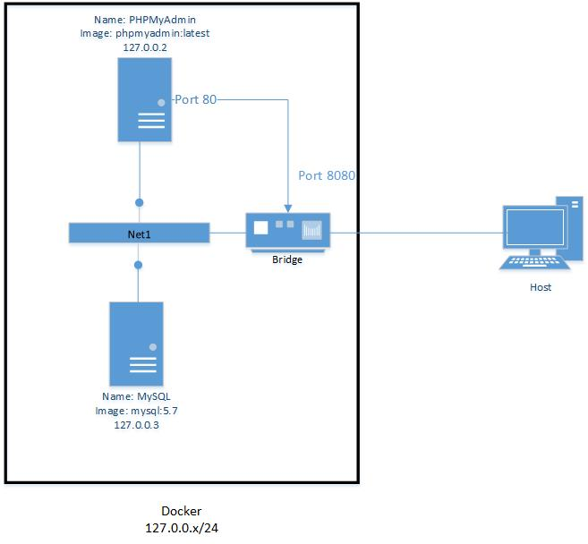

# **LB2** **Docker**  <!-- omit in toc -->

- [Kapitel 1 Der Service](#kapitel-1-der-service)
- [Kapitel 2 Technische Angaben](#kapitel-2-technische-angaben)
  - [Netzwerkplan](#netzwerkplan)
  - [Anleitung für den Betrieb](#anleitung-f%C3%BCr-den-betrieb)

# Kapitel 1 Der Service

Als Service wird eine eigene **MySQL** **Datenbank** mit **PHPMyAdmin** administriert. Anstatt per Command Line wird bei PHPMyAdmin die MySQL Datenbank per Webinterface bedient. Durch den Visuellen Faktor und dem übersichtlichem GUI wird die Arbeit mit den MYSQL Datenbank sehr vereinfacht.

# Kapitel 2 Technische Angaben

Der Service wird mit 2 Docker Container realisiert.
| **Info**     | **Container** 1 |   **Container** 2 |
| :----------- | :-------------: | ----------------: |
| Name         |    **MySQL**    |    **PHPMyAdmin** |
| Docker Image |    mysql:5.7    | phpmyadmin:latest |
| Netzwerk     |      Net1       |              Net1 |
| IP           |      DHCP       |              DHCP |

## Netzwerkplan

## Anleitung für den Betrieb

<!-- Link Index -->
This is [a Link][20min]

[20min]: https://www.20min.ch/