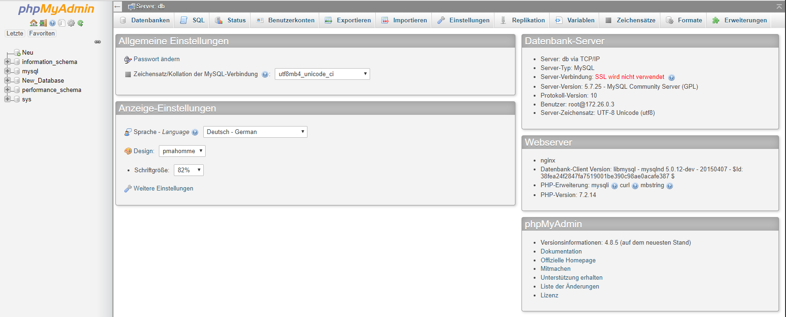
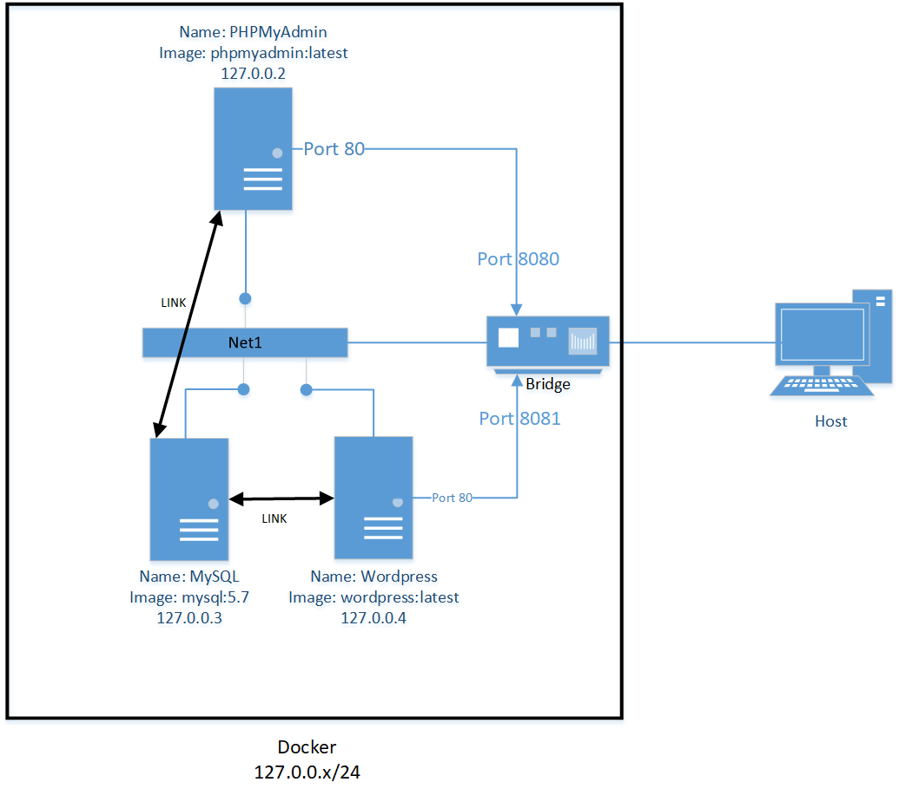

# **LB2** **Docker**  <!-- omit in toc -->

## Inhalt <!-- omit in toc -->
- [Kapitel 1 Der Service](#kapitel-1-der-service)
- [Kapitel 2 Technische Angaben](#kapitel-2-technische-angaben)
  - [Netzwerkplan](#netzwerkplan)
  - [Code](#code)
  - [Anleitung für den Betrieb](#anleitung-f%C3%BCr-den-betrieb)
- [Kapitel 3 Testing](#kapitel-3-testing)
- [Kapitel 4 Troubleshooting](#kapitel-4-troubleshooting)
- [Quellen](#quellen)

# Kapitel 1 Der Service

Als Service wird eine eigene **MySQL** **Datenbank** mit **PHPMyAdmin** administriert. Anstatt per Command Line wird bei PHPMyAdmin die MySQL Datenbank per Webinterface bedient. Durch den Visuellen Faktor und dem übersichtlichem GUI wird die Arbeit mit den MYSQL Datenbank sehr vereinfacht.

Per Interner Verlinkung zwischen MySQL und PHPMyAdmin kann dies ermöglicht werden.



# Kapitel 2 Technische Angaben

Der Service wird mit 2 Docker Container realisiert. Bei ersten wird MySQL und beim zweiten PHPMyAdmin installiert. Durch das custom "Net1" Netzwerk können die Container kommunizieren.

| **Info**       | **Container** 1 |   **Container** 2 |
| :------------- | :-------------: | ----------------: |
| Container Name |      MySQL      |        PHPMyAdmin |
| Docker Image   |    mysql:5.7    | phpmyadmin:latest |
| Netzwerk       |      Net1       |              Net1 |
| IP             |      DHCP       |              DHCP |

## Netzwerkplan



Die Container werden innerhalb von der Docker VM aufgesetzt. Das Net1 wird auf den Modus "Bridge" konfiguriert, sodass die Container vom Host erreichbar sind. Dabei ist der Host auch der Gateway zum Internet.

Die beiden Container werden am Net1 angehängt und bekommen per DHCP eine IP im Range 127.0.0.x/24. Der Gateway erhält immer die IP 172.0.0.1.

Mit einem Link kann der PHPMyAdmin auf den MySQL Container mit den Datenbanken zugreifen. Wie dies Funktioniert, wird im Abschnitt **Code** eingegangen.

Damit der Host auf das Webinterface des PHPMyAdmin zugreifen kann, muss der Container Port 80 auf den Host Port 8080 gemapt werden. Wie dies Funktioniert, wird im Abschnitt **Code** eingegangen.

## Code
Das Projekt wurde mit einem Docker Compose File realisiert. In diesem File werden alle Container und Netzwerk Parameter definiert. Mit diesem Behefl wird dann die Struktur aufgesetzt:
```Shell
docker-compose -f ʺPfad\zum\File\docker-compose.ymlʺ up -d --build
 ```
"-d" definiert, dass die Container im Hintergrund aufgesetzt wird.

"-f" setzt den den Pfad zum docker-compose.yml File

Hier der Code des docker-compose.yml File:
```Shell
1 version: '3.7'                          # Version von docker-compose.yml
2 services:                               # Auflistung der Services
3  db:                                    # Anfang MySQL Service
4    image: mysql:5.7                     # Docker Image
5    container_name: mysql                # Containername
6    networks:                            # Anfang Netzwerkkonfiguration
7    - Net1                               # Net1 als Netzwerk gesetzt
8    restart: always                      # Nach erstellen Neustarten
9    environment:                         # Anfang environment Parameter
10      MYSQL_ROOT_PASSWORD: 'Qawsed123'  # Rootpasswort von MySQL setzen
11      MYSQL_DATABASE: New_Database      # Neue Datenbank erstellt
12
13  php:                                  # Anfang PHPMyAdmin Service
14    depends_on:                         # Anfang Abhänigkeit
15      - db                              # Abhängig vom Service db
16    image: phpmyadmin:latest            # Docker Image
17    container_name: PHPMyAdmin          # Containername
18    networks:                           # Anfang Netzwerkkonfiguration
19    - Net1                              # Net1 als Netzwerk gesetzt
20    ports:                              # Anfang Portmapping
21      - "8080:80"                       # Container Port 80 auf Localhost Port 8080
22    restart: always                     # Nach erstellen Neustarten
23    environment:                        # Anfang environment Parameter
24      PMA_HOST: db                      # MySQL Datenbank ist db
25
26 networks:                              # Anfang allgemeine Netzwerkkonfiguration
27  Net1:                                 # Netzwerk Net1 erstellt
 ```
Jede Zeile wurde mit einem "#" Kommentiert.

Auf Zeile 3-11 wird der MySQL Container erstellt und konfiguriert

Auf Zeile 13-24 wird der PHPMyAdmin Container erstellt. Dabei wird auf Zeile 24 die Verlinkung zwischen PHPMyAdmin und MySQL realisiert(db = MySQL Container).

Auf der Zeile 26-27 wird das Netzwerk erstellt

Das File ist auf meinem GitHub LB2 [Repository][lb2git] abgelegt

## Anleitung für den Betrieb

# Kapitel 3 Testing

# Kapitel 4 Troubleshooting

# Quellen

**Benutzte** **Images**:

PHPMyAdmin:latest [Docker Hub][php]

MySQL:5.7 [Docker Hub][sql]

**Benutzte** **Websites**:

Mein GitHub [Repository][mygit]

Modul 300 [Repository][m300git]

Docker Compose [Dokumentation][dc]

<!-- Link Index -->

[sql]: https://hub.docker.com/_/mysql

[php]: https://hub.docker.com/r/phpmyadmin/phpmyadmin/

[mygit]: https://github.com/YanikVonderschmitt/my_M300

[lb2git]: https://github.com/YanikVonderschmitt/my_M300/tree/master/Docker/LB2

[m300git]: https://github.com/mc-b/M300

[dc]: https://docs.docker.com/compose/