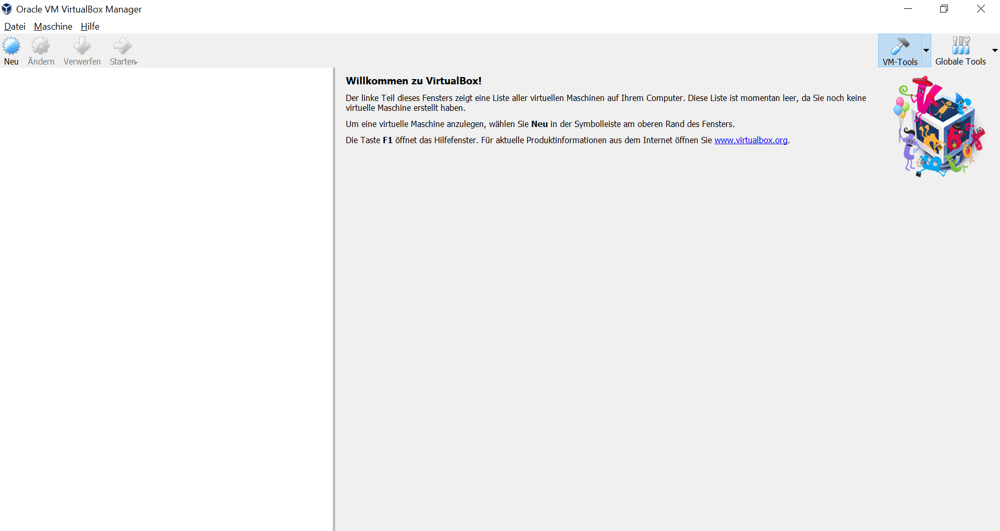
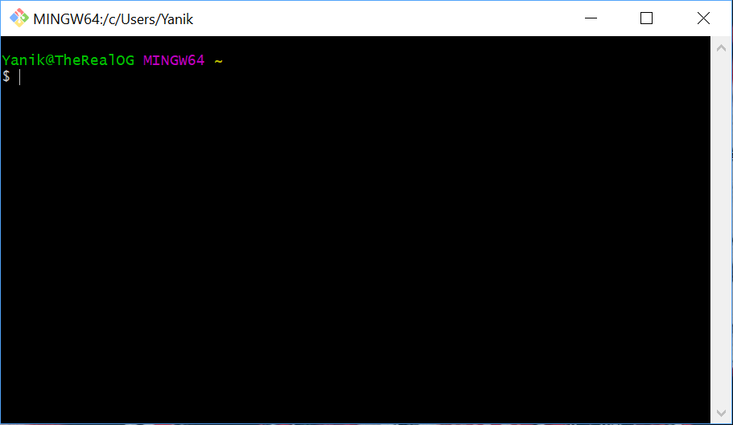
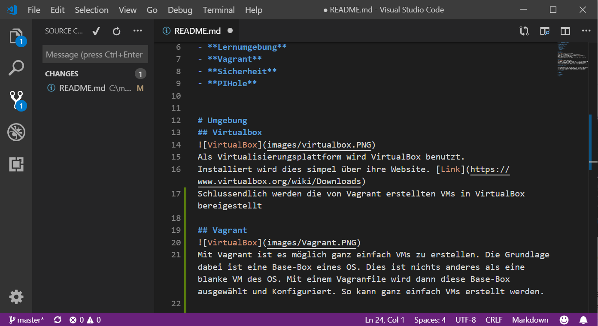
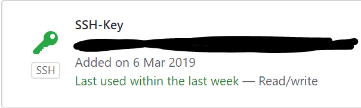
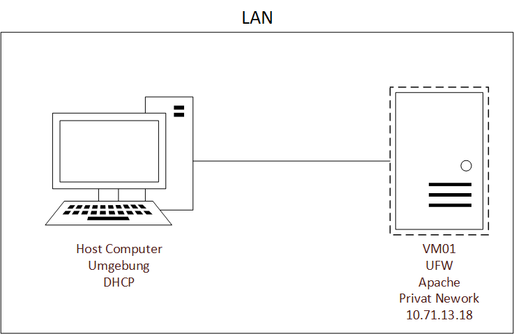

# LB 1 Yanik Vonderschmitt

  

## Inhaltsverzeichnis

  
[**Vorwort**](#Vorwort)

**Umgebung**
- [VirtualBox](#Virtualbox)
- [Git-Client](#Git-Client)
- [Vagrant](#Vagrant)
- [Sicherheit](#Sicherheit)
- [Netzwerk](#Netzwerk)

**Umsetzung**
- [VM](#VM)
- [Firewall](#Firewall)
- [Apache](#Apache)

**Schluss**
- [Reflexion](#Reflexion)
- [Wissensstand](#Wissensstand)
- [Lernschritte](#Lernschritte)

**Anhang**
- [Versionen](#Versionen)


  
 # Vorwort
 ## Markdown
  Die Dokumentation ist im Markdown Format geschrieben. Dieses Format eignet sich sehr für die Website GitHub, da dort der Inhalt sofort angezeigt wird. [Wikipedia](https://de.wikipedia.org/wiki/Markdown)
  
 ## GitHub
 GitHub ist eine Website um eigene Software-Entwicklungsprojekte online zu stellen. Dabei stellt GitHub den Speicherplatz zur Verfügung. GitHub arbeitet mit "repositories" was nichts anderes wie Speicherorte sind. Mittels Git-Client können ganze Repositories lokal auf den Computer importiert werden (Pull) und wiederum aufs auf Git-Hub exportiert werden(Push). So kann lokal gearbeitet werden. Hier die [Website](https://github.com/)

# Umgebung

## VirtualBox
### Infos



Als Virtualisierungsplattform wird VirtualBox benutzt. Installiert wird dies simpel über ihre Website. [Link](https://www.virtualbox.org/wiki/Downloads). Schlussendlich werden die von Vagrant erstellten VMs in VirtualBox bereitgestellt. Alternativ könnten in VirtualBox VMs mit .iso Dateien per Hand installiert werden.

## Git-Client
### Infos


Git Client wird benutzt um Repositories und Vagrant zu bedienen. Befehle werden dazu in die Git Client Kommandozeile geschrieben. Ihn kann man auf dieser [Website](https://git-scm.com/downloads) herunterladen und installieren.
### Git-Client Befehle
Mittels Git-Befehle können Repositories verwaltet werden.

**GitHub Account hinterlegen**

Um mit seinen Online Repositories zu arbeiten muss der GitHub Account hinterlegt werden.
 ```Shell
      $ git config --global user.name "<username>"
	  $ git config --global user.email "<e-mail>"
 ```
**Repositories importieren**

So werden Online Repositories lokal importiert.
```Shell
	$ cd Wohin\auch\immer
	$ git clone git@github.com:<Ihr Name>/my_M300.git
 ```
**Repositories runterladen**

Falls es Änderungen im Online Repository gibt, kann dieser so importiert werden. Dabei wird das veraltete auf die neue Version angepasst.
 ```Shell
	$ git pull
 ```
 
**Repositories hochladen**

Um das lokale Repository online hochzuladen wird dieser Befehl benutzt. Dabei wird dann die Online Version mit der lokalen überschrieben.
 ```Shell
      $ git commit -m "Mein Kommentar"
      $ git push
 ```
  

## Vagrant
### Infos


Mit Vagrant ist es möglich ganz einfach VMs zu erstellen. Die Grundlage dabei ist eine Base-Box eines OS. Dies ist nichts anderes als eine blanke VM des OS. Mit einem Vagranfile wird dann diese Base-Box ausgewählt und Konfiguriert. So kann ganz einfach VMs erstellt werden.

### Vagrant Befehle
Vagrant wird per Git-Client mit Befehlen gesteuert.
**Neues Vagrantfile erstellen**

Zuerst muss in den gewählten Ordner gewechselt werden und dort wird dann das Vagrantfile erstellt
```Shell
      $ cd Wohin\auch\immer
      $ vagrant init
 ```
**VM erstellen lassen**

Um eine VM zu erstellen muss zuerst ins gleiche Verzeichnis wie das Vagrantfile gewechselt werden und dann wird die VM erstellt.
 ```Shell
      $ cd Zum\Vagrantfile
      $ vagrant up
 ```

**Mittels SSH auf VM verbinden**

Es ist möglich per SSH Verschlüsselung sich mit der VM zu verbinden. Dazu muss ins gleiche Verzeichnis wie die VM gewechselt und dann verbunden werden.

```Shell
      $ cd Zur\VM
      $ vagrant ssh
 ```
**VM herunterfahren**

Wenn man die VM herunter fahren möchte muss dieser Befehl eingegeben werden.
```Shell
      $ Vagrant halt
 ```
  
 **VM löschen**
 
Wenn die VM gelöscht werden will wird dieser Befehl benutzt. Dazu muss sie herunter gefahren sein.
```Shell
      $ Vagrant destroy
 ```
 
 ### Vagrant Cloud-boxen
 Grosser Vorteil von Vagrant ist die Auswahl von den Base-boxen, aus welchen dann die VMs gemacht werden. Die Auswahl ist online auf dieser [Website](https://app.vagrantup.com/boxes/search) zu finden.
 

## Visual Code Studio



Visual Code Studio ist ein Quelltext Editor von Microsoft. Damit können Programme in verschiedenen Programmiersprachen geschrieben werden. Plug-Ins können installiert werden umso das arbeiten zu erleichtern.

### Plug-Ins
Um Plug_ins zu installieren muss die Tastenkombination `CTRL` + `SHIFT` + `X`gedrückt werden. Dann können Plug-Ins gesucht werden.
Zum arbeiten an dieser LB wurden 3 Plug-Ins benutzt:
-   Markdown All in One (von Yu Zhang)
-   Vagrant Extension (von Marco Stanzi)
-   vscode-pdf Extension (von tomiko1207)

# Sicherheit

## SSH Key zu GitHub

  

Mit SSH können Verbindungen verschlüsselt werden. Dies wird hier eingesetzt, um die Verbindung zum Online Repository zu sichern, wenn dies Importiert oder Exportiert wird.

## SSH Tunnel
Es ist möglich per SSH Verschlüsselung sich mit der VM zu verbinden. Dazu muss ins gleiche Verzeichnis wie die VM gewechselt und dann verbunden werden.
```Shell
      $ cd Zur\VM
      $ vagrant ssh
 ```

## Firewallrules
Es benötigt nur 2 Regeln

**Regel für SSH**

Damit per SSH auf den Server verbunden werden kann, muss der **Port 22** geöffnet werden.
**Regel für http**

Damit schlussendlich auf den Webserver zugegriffen werden kann, muss der **Port 80** geöffnet werden.


## Benutzer
Vagrant erstellt automatisch einen Benutzer namens "Vagrant". Dieser hat bereits **Root** Rechte und kann somit alle benötigten Services installieren und konfigurieren.

# Netzwerk


Der Zugriff zwischen Host und VM geschieht nur im LAN des Hosts. Darum ist die VM01 auf Privat Network konfguriert.

# Umsetzung
## VM
Die VM wird im Vagrantfile folgendermassen installiert:
```Shell
Vagrant.configure("2") do |config|

config.vm.box =  "ubuntu/xenial64"

config.vm.provider "virtualbox"  do |vb|

vb.memory =  "1024"

config.vm.network "private_network", ip: "10.71.13.18"

end
 ```

## Firewall
Als Firewall wird der Dienst  "Uncomplicated Firewall" installiert. Dies ist eine leicht zu bedienende Firewall mit wenigen Befehlen. Hier der zur [Website](https://wiki.ubuntuusers.de/ufw/) Website.

### Installation
**Installieren**

Zuerst wird der Paketdients aktualisiert. Das -y bestätigt die Installation. Der Dienst installiert wird so:
```Shell
    apt-get update
    apt-get install -y ufw gufw
 ```
**Ports öffnen**

Die Ports für SSH und http werden so geöffnet
```Shell
	ufw allow ssh
	ufw allow 80/tcp
 ```
**Firewall Dienst starten**

Nach der Konfiguration wird die Firewall gestartet. Das yes Y bestätigt die Installation.
```Shell
	yes Y | ufw enable
 ```
 
### Test
Testen kann man die Firewall indem man sie startet und die Ports nicht geöffnet hat. Dann ist der Zugriff per SSH und HTTP blockiert.

## Apache
### Installation
Apache ist ein Webserver. Nach der Installation wird eine Standardwebseite aufgeschalten. Darum muss der Webserver nicht konfiguriert werden.

**Installieren**

Zuerst wird der Paketdients aktualisiert. Das -y bestätigt die Installation. Der Dienst installiert wird so:
```Shell
    apt-get update
    apt-get install -y apache2
 ```

### Test
Wenn alles geklappt hat kann man die IP der VM im Browser des Hosts eingeben und die Standardwebseite erscheint.

# Schluss
## Reflexion
Ich muss zugeben, dass ich den Aufwand der LB unterschätzt habe. Der Zeitaufwand zum Verstehen von Vagrant und Markdown war grösser als erwartet. Nach den 2 Nachmittagen verstand ich diese 2 Sachen noch nicht sehr gut. Vielleicht liegt es am Umfeld in der TBZ, weil als ich mich Zuhause dahintergesetzt habe verstand ich es plötzlich. Zuhause konnte ich mich besser Konzentrieren. Dass alles am Schluss geklappt hat war sehr gut für meine Motivation für dieses Modul. Ich werde vielleicht Vagrant vermehrt einsatzen, da ich jetzt gelernt habe wie einfach und schnell man so VMs aufsetzen kann
## Wissensstand Vorher-Nachher
**Vorher:**

- Linux Grundwissen
- Apache
- Netzwerk

**Nachher**

Zusätzlich:

- Vagrant
- Markdown
- GitHub Handhabung
## Lernschritte
1. Lernen ich wie man Git Bedient. Dies dauerte nicht lange, da es nicht viele Befehle waren.
2. Erstellung einer VM per Vagrantfile. Ich fand dies schwieriger, da ich das Wissen aus dem Internet holen musst und so nur mit der Zeit zusammenhänge sichbar wurden.
3. Dokumentieren mit Markdown. Ich benutzte dazu das CHeatsheet auf dem BSCW. Mit Übung kommt man auch schneller voran.
# Anhang
## Versionen

**Virtualbox**

Version 5.2.26 r128414

**Vagrant**

Version 2.2.4

**Visual** **Code** **Studio**

Version 1.32.3

**Git**-**Client**

Version 2.21.0

**Uncomplicated** **Firewall**

Version 0.35

**Apache**

Version 2.4