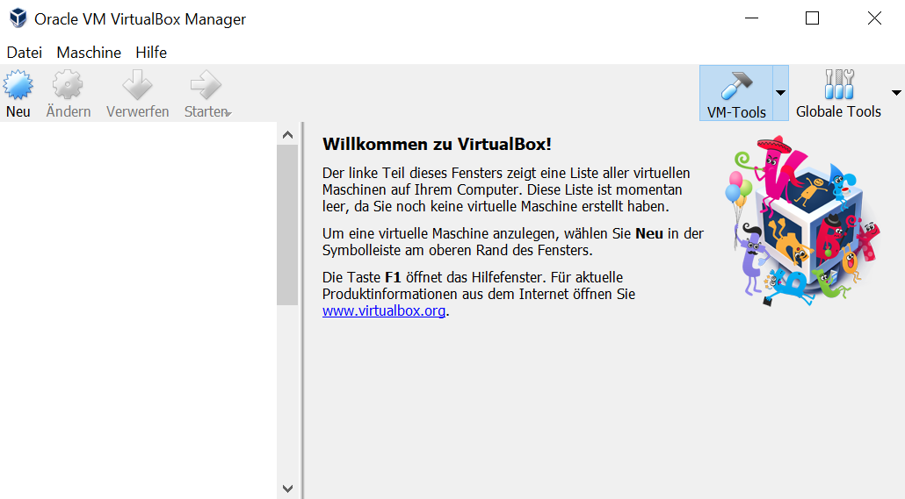

# LB 1 Yanik Vonderschmitt

## Inhaltsverzeichnis

- **Umgebung**
- **Lernumgebung**
- **Vagrant**
- **Sicherheit**
- **PIHole**

# Umgebung
## Virtualbox

Als Virtualisierungsplattform wird VirtualBox benutzt.
Installiert wird dies simpel über ihre Website. [Link](https://www.virtualbox.org/wiki/Downloads)

# Lernumbgebung

# Vagrant

# Sicherheit

# PIHole

